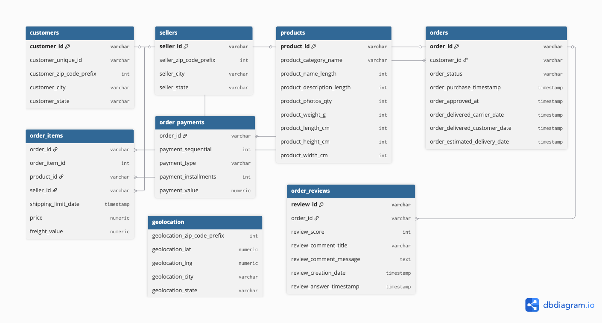

# Olist E-Commerce Analytics

## 🏢 Company Background
I am working as a **Data Analyst** at a fictional Brazilian e-commerce company called **Olist**.  
The company sells products online and partners with multiple sellers.  
My role is to explore sales, customer, and delivery data to generate insights for decision-making.

---

## 📊 Project Overview
This project analyzes Olist’s e-commerce dataset, which contains **8 related tables** and millions of rows.  
The data is stored in **PostgreSQL**, and we use **Python + Pandas + SQLAlchemy** for analysis.  
Future steps will include building **visualizations** using Apache Superset.

---

## 🗂 Dataset
The dataset includes the following tables:

- `customers`
- `orders`
- `order_items`
- `payments`
- `products`
- `sellers`
- `geolocation`
- `product_category_name_translation`

---

## 📌 Example Analytics
- Sales trends over time
- Best performing sellers
- Average review scores
- Delivery performance (on-time vs late)
- Payment types and distribution

---

## 📷 Screenshot (Placeholder)
  

---

## ⚙️ Tools Used
- PostgreSQL (database)
- Python (analysis scripts)
- Pandas (data manipulation)
- SQLAlchemy + pg8000 (database connection)
- GitHub (repository)
- Apache Superset (future visualization)

---

## 🚀 How to Run This Project

1. **Clone the repository**:
   ```bash
   git clone https://github.com/your-username/olist-ecommerce-analytics.git
   cd olist-ecommerce-analytics

